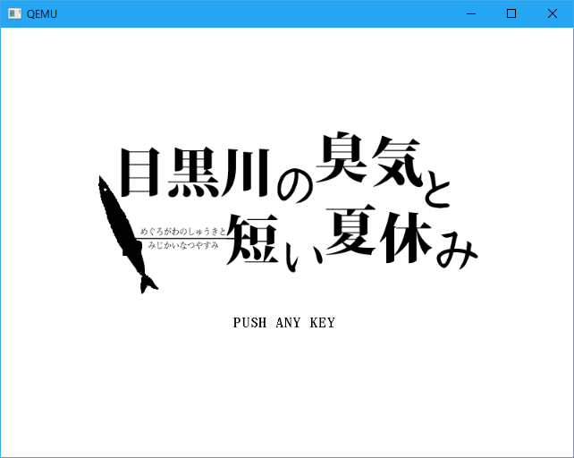
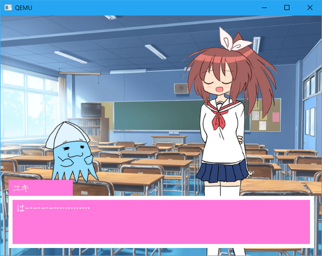

# UEFIでうごくゲームを作ってみた〜2017年夏休みの自由研究〜

弊社で夏休みの自由研究というテーマの発表があったので作ってみた。

スライドはこちら→[UEFIでうごくゲームを作ってみた〜2017年夏休みの自由研究〜](https://speakerdeck.com/narazaka/uefideugokugemuwozuo-tutemita-2017nian-xia-xiu-mifalsezi-you-yan-jiu)

下のようなノベルゲーもどきが動きます。

[ダウンロードはこちら](https://github.com/Narazaka/efigame/releases/tag/period0)

出来たらざっくりとしたゲームライブラリにしたい……

## ライセンス

リポジトリ内のものは以下の例外を除きMITライセンスです。

- JF-Dot-Kappa20-0213.ttfはパブリックドメインのフォントです。
- surface0.png, scrn1.png, scrn2.pngの著作権は、[奈良阪](https://github.com/Narazaka)に帰属します。著作権所有者への事前の承諾を得ること無しに、その全てまたは一部をいかなる形式、いかなる手段によっても、複製・改変・再配布・再出版・ダウンロード・表示・掲示または転送することを禁じます。
